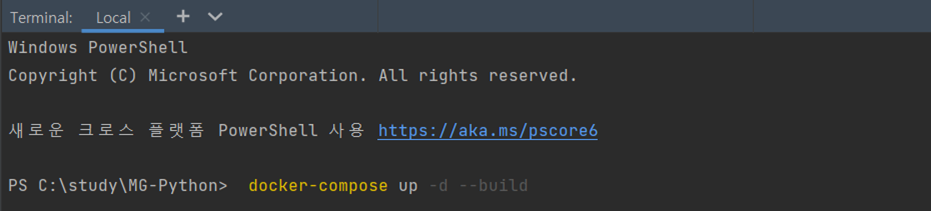
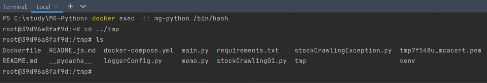
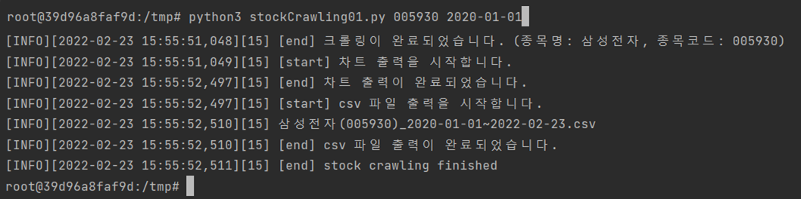
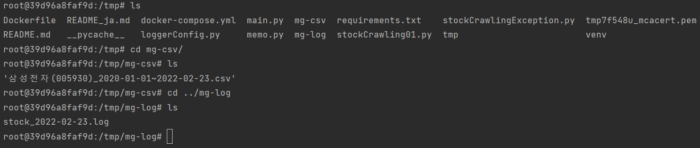

## Python 을 이용한 네이버 일별 주가데이터 크롤링

<br>

### 구현 내용
종목코드와 취득개시일을 입력하면, 
취득개시일부터 실행일 현재까지의 종가와 거래량을 취득하여 csv파일을 출력합니다.

### 실행 방법
* 커맨드 창 입력 : stockCrawling01.py 종목코드(6자리 숫자) 취득개시일(yyyy-mm-dd)
* 입력예1 : 삼성전자, 2020년 1월 1일부터 현재시간까지 일별 주가 데이터 취득
```
stockCrawling01.py 005930 2020-01-01
```
* 입력예2 : LG에너지솔루션, 2021년 12월 1일부터 현재시간까지 일별 주가 데이터 취득
```
stockCrawling01.py 373220 2021-12-01
```

### 출력결과 확인
* 브라우저로 일봉과 거래량 차트가 출력됩니다.
* csv파일은 이하의 형식으로 출력됩니다.
  * ../tmp/mg-csv/종목명_종목코드_yyyy-mm-dd~yyyy-mm-dd.csv
* 출력예1 : 삼성전자, 2020년 1월 1일부터 현재시간(2022년 2월 8일)까지 일별 주가 데이터 취득
```
삼성전자_005930_2020-01-01~2022-02-08.csv
```
* 출력예2 : LG에너지솔루션, 2021년 12월 1일부터 현재시간(2022년 2월 8일)까지 일별 주가 데이터 취득
```
LG에너지솔루션_373220_2021-12-01~2022-02-08.csv
```
* 차트는 png 파일과 html 파일로 출력됩니다. 
* 차트는 이하의 형식으로 출력됩니다.
  * ../tmp/mg-csv/종목코드_chart_yyyy-mm-dd~yyyy-mm-dd.png
  * ../tmp/mg-csv/종목코드_chart_yyyy-mm-dd~yyyy-mm-dd.html
```
삼성전자(005930)의 경우
png 파일 : ../tmp/chart/005930_chart_2020-01-01~2022-03-02.png
html 파일 : ../tmp/chart/005930_chart_2020-01-01~2022-03-02.html
```

<br>

**(참고)**
* 로그 출력
  * ../tmp/mg-log/stock_yyyy-mm-dd.log

<br/>

<hr>

## DOCKER 이용

### 환경설정
명령 프롬프트 창에서 다음의 커맨드를 실행하여 docker-compose.yml으로 정의한 컨테이너를 실행합니다.

```
docker-compose up -d --build
```


빌드가 완료되면 컨테이너를 확인합니다.

```
docker ps
```


### 실행
명령 프롬프트 창에서 다음의 커맨드를 실행하여 docker container에 접속합니다.
```
docker exec -it mg-python /bin/bash
```
tmp 이하의 폴더에 실행파일이 생성된 것을 확인합니다.



**python3**을 입력하여 실행합니다.
<br/><br/>
**입력 예**
```
python3 stockCrawling01.py 005930 2020-01-01
```


<br/>

### 출력결과 확인

각각 출력된 csv 파일과 log를 확인할 수 있습니다.
<br/>

* csv 파일 : ../tmp/mg-csv
* log 파일 : ../tmp/mg-log

```
cat 출력파일명.csv
cat 출력파일명.log
```


<br/>

차트는 png 파일과 html 파일로 출력됩니다. 

* png 파일 : ../tmp/chart/005930_chart_2020-01-01~2022-03-02.png
* html 파일 : ../tmp/chart/005930_chart_2020-01-01~2022-03-02.html
