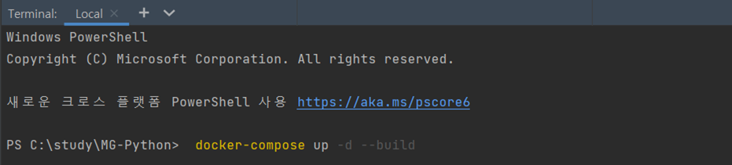
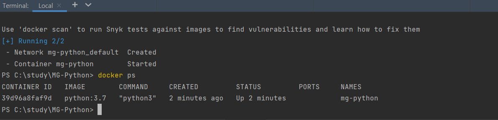
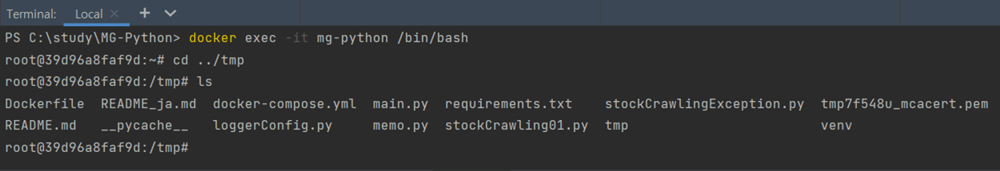
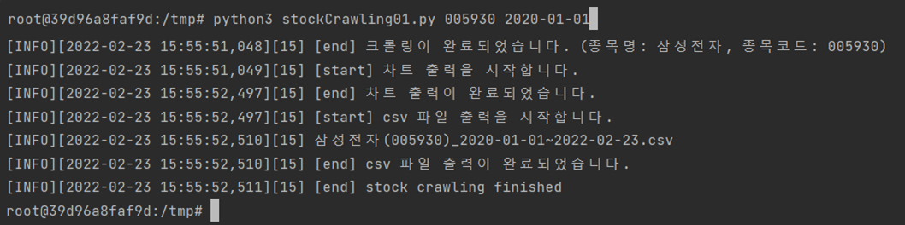

## Pythonを利用したNAVERの時系列株価データクローリング

<br>

### 実装内容
株式の銘柄コードと取得開始日を入力すると、
取得開始日から実行日現在までの終値と出来高を取得してcsvファイルを出力します。

### 実行方法 
※　韓国の株式のみ実行できます。
* コマンドプロンプトに入力 : stockCrawling01.py 株式の銘柄コード(6桁の数字) 取得開始日(yyyy-mm-dd)
* 入力例1 : 005930(サムスン電子), 2020年1月1日から現在日付までの時系列株価データを取得
```
stockCrawling01.py 005930 2020-01-01
```
* 入力例2 : 373220(LGエナジーソリューション), 2021年12月1日から現在日付までの時系列株価データを取得
```
stockCrawling01.py 373220 2021-12-01
```

### 出力結果の確認
* ブラウザで日足チャートと出来高チャートが出力されます。
* csvファイルは以下の形式で出力されます。
  * ../tmp/mg-csv/株式名称(銘柄コード)_yyyy-mm-dd~yyyy-mm-dd.csv
* 出力例1 : 삼성전자, 2020年1月1日から現在日付(2022年2月8日)までの時系列株価データを取得
```
삼성전자(005930)_2020-01-01~2022-02-08.csv
```
* 出力例2 : LG에너지솔루션, 2021年12月1日から現在日付(2022年2月8日)までの時系列株価データを取得
```
LG에너지솔루션(373220)_2021-12-01~2022-02-08.csv
```

<br>

**(備考)**
* ログの出力
  * ../tmp/mg-log/stock_yyyy-mm-dd.log

<br/>

<hr>

## DOCKER 利用

### 環境設定
コマンドプロンプトで以下のコマンドを実行してdocker-compose.ymlで定義したコンテイナーを実行します。

```
docker-compose up -d --build
```


ビルドができたらコンテイナーの確認します。

```
docker ps
```


### 実行
コマンドプロンプトで以下のコマンドを実行してdocker containerに接続します。
```
docker exec -it mg-python /bin/bash
```
tmpのフォルダに実行ファイルが生成されていることを確認します。



**python3**を入力して実行します。
<br/><br/>
**入力例**
```
python3 stockCrawling01.py 005930 2020-01-01
```


<br/>
それぞれ出力されたcsvファイルとlogファイルを確認できます。
<br/>

* csvファイル : tmp/mg-csv
* logファイル : tmp/mg-log

```
cat 出力されたファイル名.csv
cat 出力されたファイル名.log
```

<br/><br/>
<hr>

**残りの課題**

Dockerで実行する場合、出力されるチャートの確認方法
